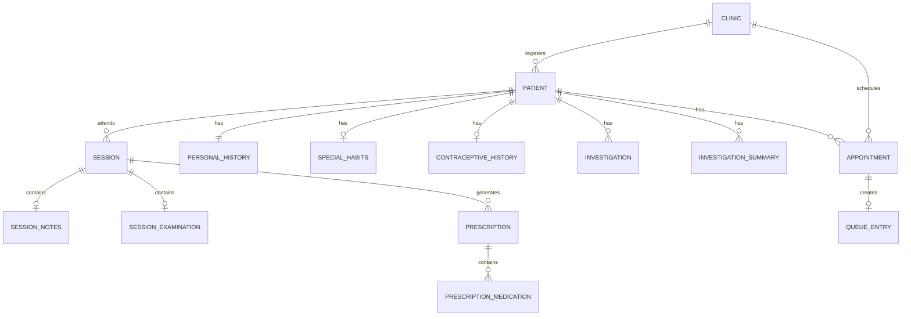

# Database Schema Design

## Overview

The database is normalized into separate tables for better data integrity, performance, and maintainability. We use PostgreSQL via Supabase with Prisma ORM.

---

## Entity Relationship Diagram



---

## Core Tables

### 1. Clinic

```prisma
model Clinic {
  id        String   @id @default(cuid())
  name      String
  phone     String?
  createdAt DateTime @default(now()) @map("created_at")
  updatedAt DateTime @updatedAt @map("updated_at")

  patients     Patient[]
  appointments Appointment[]

  @@map("clinics")
}
```

> **Note**: Staff (doctors/receptionists) have access to both clinics, so no `clinicId` on User.

### 2. User (Staff)

```prisma
model User {
  id        String   @id  // Same ID as Supabase Auth user
  email     String   @unique
  name      String
  role      UserRole @default(RECEPTIONIST)
  createdAt DateTime @default(now()) @map("created_at")
  updatedAt DateTime @updatedAt @map("updated_at")

  appointments Appointment[] @relation("BookedBy")
  sessions     Session[]     @relation("ConductedBy")

  @@map("users")
}

enum UserRole {
  DOCTOR
  RECEPTIONIST
}
```

---

## Patient Tables

### 3. Patient (Core)

```prisma
model Patient {
  id        String   @id @default(cuid())
  clinicId  String   @map("clinic_id")
  createdAt DateTime @default(now()) @map("created_at")
  updatedAt DateTime @updatedAt @map("updated_at")

  // Core medical info (stored directly for quick access)
  drugHistory          String? @map("drug_history")
  complaint            String?
  presentHistory       String? @map("present_history")
  pastHistory          String? @map("past_history")
  familyHistory        String? @map("family_history")
  provisionalDiagnosis String? @map("provisional_diagnosis")
  comments             String?

  // Relations
  clinic               Clinic                @relation(fields: [clinicId], references: [id])
  personalHistory      PersonalHistory?
  specialHabits        SpecialHabits?
  contraceptiveHistory ContraceptiveHistory?
  generalAppearance    GeneralAppearance?
  generalExamination   GeneralExamination?
  previousMedications  PreviousMedication[]
  investigations       Investigation[]
  investigationSummaries InvestigationSummary[]
  sessions             Session[]
  appointments         Appointment[]

  @@map("patients")
}
```

### 4. Personal History

```prisma
model PersonalHistory {
  id            String   @id @default(cuid())
  patientId     String   @unique @map("patient_id")
  fullName      String   @map("full_name")
  phoneNumber   String   @map("phone_number")
  dateOfBirth   DateTime @map("date_of_birth")
  sex           String?
  maritalStatus String?  @map("marital_status")
  offsprings    Int?
  occupation    String?
  residence     String?

  patient Patient @relation(fields: [patientId], references: [id], onDelete: Cascade)

  @@map("personal_histories")
}
```

### 5. Special Habits

```prisma
model SpecialHabits {
  id              String  @id @default(cuid())
  patientId       String  @unique @map("patient_id")
  diet            String?
  smokingType     String? @map("smoking_type")
  smokingDuration Int?    @map("smoking_duration")
  smokingAmount   Int?    @map("smoking_amount")
  alcohol         Boolean @default(false)
  others          String?

  patient Patient @relation(fields: [patientId], references: [id], onDelete: Cascade)

  @@map("special_habits")
}
```

### 6. Contraceptive History

```prisma
model ContraceptiveHistory {
  id                 String  @id @default(cuid())
  patientId          String  @unique @map("patient_id")
  menarche           Int?
  menstrualPeriod    String? @map("menstrual_period")
  historyOfAbortion  String? @map("history_of_abortion")
  modeOfContraceptive String? @map("mode_of_contraceptive")

  patient Patient @relation(fields: [patientId], references: [id], onDelete: Cascade)

  @@map("contraceptive_histories")
}
```

### 7. General Appearance

```prisma
model GeneralAppearance {
  id           String  @id @default(cuid())
  patientId    String  @unique @map("patient_id")
  built        String?
  behavior     String?
  intelligence String?
  facies       String?
  decubitus    String?

  patient Patient @relation(fields: [patientId], references: [id], onDelete: Cascade)

  @@map("general_appearances")
}
```

### 8. General Examination (Baseline)

```prisma
model GeneralExamination {
  id                        String  @id @default(cuid())
  patientId                 String  @unique @map("patient_id")
  bloodPressure             Float?  @map("blood_pressure")
  supine                    Float?
  standing                  Float?
  temperature               Float?
  respiratoryRate           Float?  @map("respiratory_rate")
  head                      String?
  neckLymphNodes            String? @map("neck_lymph_nodes")
  neckVeins                 String? @map("neck_veins")
  thyroid                   String?
  upperLimb                 String? @map("upper_limb")
  lowerLimb                 String? @map("lower_limb")
  peripheralPulsation       String? @map("peripheral_pulsation")
  cardiologicalExamination  String? @map("cardiological_examination")
  chestExamination          String? @map("chest_examination")
  abdominalExamination      String? @map("abdominal_examination")
  neurologicalExamination   String? @map("neurological_examination")

  patient Patient @relation(fields: [patientId], references: [id], onDelete: Cascade)

  @@map("general_examinations")
}
```

### 9. Previous Medications

```prisma
model PreviousMedication {
  id        String @id @default(cuid())
  patientId String @map("patient_id")
  drug      String
  frequency String?

  patient Patient @relation(fields: [patientId], references: [id], onDelete: Cascade)

  @@map("previous_medications")
}
```

---

## Investigation Tables

### 10. Investigation

```prisma
model Investigation {
  id        String    @id @default(cuid())
  patientId String    @map("patient_id")
  date      DateTime?
  type      String?   @map("invest")
  report    String?
  createdAt DateTime  @default(now()) @map("created_at")

  patient Patient              @relation(fields: [patientId], references: [id], onDelete: Cascade)
  images  InvestigationImage[]

  @@map("investigations")
}

model InvestigationImage {
  id              String @id @default(cuid())
  investigationId String @map("investigation_id")
  url             String
  fileName        String @map("file_name")

  investigation Investigation @relation(fields: [investigationId], references: [id], onDelete: Cascade)

  @@map("investigation_images")
}
```

### 11. Investigation Summary Sheet

```prisma
model InvestigationSummary {
  id        String   @id @default(cuid())
  patientId String   @map("patient_id")
  date      DateTime @default(now())

  // Hematology
  hb          Float? @map("hb")
  wbc         Float? @map("wbc")
  neutrophils Float?
  lymphocytes Float?
  platelets   Float?
  esr         Float?
  crp         Float?

  // Metabolic
  glucose   Float?
  glucosePP Float? @map("glucose_pp")
  hba1c     Float?
  sodium    Float? @map("na")
  potassium Float? @map("k")
  calcium   Float? @map("ca")
  phosphate Float? @map("po4")
  magnesium Float? @map("mg")
  albumin   Float?

  // Liver
  sgot           Float?
  sgpt           Float?
  totalBilirubin Float? @map("total_bilirubin")
  directBilirubin Float? @map("direct_bilirubin")
  ggt            Float?
  alp            Float?

  // Kidney
  urea       Float?
  creatinine Float?
  gfr        Float?
  uricAcid   Float? @map("uric_acid")

  // Lipids
  cholesterol Float?
  ldl         Float?
  hdl         Float?
  triglycerides Float? @map("tg")

  // Thyroid
  ft3 Float?
  ft4 Float?
  tsh Float?
  pth Float?

  // Urine
  urineRbc     Float?  @map("urine_rbc")
  pusCells     Float?  @map("pus_cells")
  crystals     String?
  urineAlbumin String? @map("urine_alb")
  proteinCreatinine String? @map("protein_creatinine")
  urineCulture String? @map("urine_culture")

  // Virology
  hbsAg String? @map("hbs_ag")
  hcAb  String? @map("hc_ab")
  hivAb String? @map("hiv_ab")

  // Iron/Drug
  inr      Float?
  iron     Float?
  ferritin Float?
  tibc     Float?
  tsat     Float?
  psaFree  Float?  @map("psa_free")
  psaTotal Float?  @map("psa_total")
  psaRatio Float?  @map("psa_ratio")
  drugLevel String? @map("drug_level")

  // Immunology
  ana     String?
  antiDna String? @map("anti_dna")
  c3      Float?
  c4      Float?
  rf      String?
  antiCcp String? @map("anti_ccp")
  ancaC   String? @map("anca_c")
  ancaP   String? @map("anca_p")
  spep    String?

  patient             Patient                @relation(fields: [patientId], references: [id], onDelete: Cascade)
  extraInvestigations ExtraInvestigation[]

  @@map("investigation_summaries")
}

model ExtraInvestigation {
  id                     String  @id @default(cuid())
  investigationSummaryId String  @map("investigation_summary_id")
  name                   String
  result                 String?

  investigationSummary InvestigationSummary @relation(fields: [investigationSummaryId], references: [id], onDelete: Cascade)

  @@map("extra_investigations")
}
```

---

## Session & Prescription Tables

### 12. Session

```prisma
model Session {
  id         String   @id @default(cuid())
  patientId  String   @map("patient_id")
  doctorId   String   @map("doctor_id")
  date       DateTime @default(now())
  createdAt  DateTime @default(now()) @map("created_at")
  updatedAt  DateTime @updatedAt @map("updated_at")

  patient      Patient             @relation(fields: [patientId], references: [id], onDelete: Cascade)
  doctor       User                @relation("ConductedBy", fields: [doctorId], references: [id])
  notes        SessionNotes?
  examination  SessionExamination?
  prescriptions Prescription[]

  @@map("sessions")
}
```

### 13. Session Notes

```prisma
model SessionNotes {
  id        String  @id @default(cuid())
  sessionId String  @unique @map("session_id")
  notes     String?

  session Session @relation(fields: [sessionId], references: [id], onDelete: Cascade)

  @@map("session_notes")
}
```

### 14. Session Examination

```prisma
model SessionExamination {
  id                        String  @id @default(cuid())
  sessionId                 String  @unique @map("session_id")
  bloodPressure             String? @map("blood_pressure")
  supine                    Float?
  standing                  Float?
  temperature               Float?
  respiratoryRate           Float?  @map("respiratory_rate")
  head                      String?
  neckLymphNodes            String? @map("neck_lymph_nodes")
  neckVeins                 String? @map("neck_veins")
  thyroid                   String?
  upperLimb                 String? @map("upper_limb")
  lowerLimb                 String? @map("lower_limb")
  peripheralPulsation       String? @map("peripheral_pulsation")
  cardiologicalExamination  String? @map("cardiological_examination")
  chestExamination          String? @map("chest_examination")
  abdominalExamination      String? @map("abdominal_examination")
  neurologicalExamination   String? @map("neurological_examination")

  session Session @relation(fields: [sessionId], references: [id], onDelete: Cascade)

  @@map("session_examinations")
}
```

### 15. Prescription

```prisma
model Prescription {
  id        String   @id @default(cuid())
  sessionId String   @map("session_id")
  createdAt DateTime @default(now()) @map("created_at")

  session     Session                  @relation(fields: [sessionId], references: [id], onDelete: Cascade)
  medications PrescriptionMedication[]

  @@map("prescriptions")
}
```

### 16. Prescription Medication

```prisma
model PrescriptionMedication {
  id             String    @id @default(cuid())
  prescriptionId String    @map("prescription_id")
  patientId      String    @map("patient_id") // For active medication tracking
  type           String?
  medication     String
  dosage         String?
  frequency      String?
  duration       String?
  startDate      DateTime? @map("start_date")
  stopDate       DateTime? @map("stop_date")
  isActive       Boolean   @default(true) @map("is_active")

  prescription Prescription @relation(fields: [prescriptionId], references: [id], onDelete: Cascade)

  @@index([patientId, isActive])
  @@map("prescription_medications")
}
```

---

## Appointment & Queue Tables

### 17. Appointment

```prisma
model Appointment {
  id           String            @id @default(cuid())
  patientId    String            @map("patient_id")
  clinicId     String            @map("clinic_id")
  bookedById   String            @map("booked_by_id")
  date         DateTime          @db.Date
  status       AppointmentStatus @default(SCHEDULED)
  notes        String?
  createdAt    DateTime          @default(now()) @map("created_at")
  updatedAt    DateTime          @updatedAt @map("updated_at")

  patient  Patient     @relation(fields: [patientId], references: [id], onDelete: Cascade)
  clinic   Clinic      @relation(fields: [clinicId], references: [id])
  bookedBy User        @relation("BookedBy", fields: [bookedById], references: [id])
  queue    QueueEntry?

  @@unique([patientId, date, clinicId])
  @@index([date, clinicId])
  @@map("appointments")
}

enum AppointmentStatus {
  SCHEDULED  // Booked for the day
  ARRIVED    // Patient has arrived
  IN_SESSION // Currently with doctor
  COMPLETED  // Session finished
  NO_SHOW    // Did not arrive
  CANCELLED
}
```

### 18. Queue Entry

```prisma
model QueueEntry {
  id            String    @id @default(cuid())
  appointmentId String    @unique @map("appointment_id")
  queueNumber   Int       @map("queue_number")
  arrivedAt     DateTime  @default(now()) @map("arrived_at")
  calledAt      DateTime? @map("called_at")
  completedAt   DateTime? @map("completed_at")

  appointment Appointment @relation(fields: [appointmentId], references: [id], onDelete: Cascade)

  @@map("queue_entries")
}
```

---

## Database Indexes

```prisma
// Additional indexes for performance
@@index([patientId]) on Session
@@index([date, clinicId, status]) on Appointment
@@index([patientId, isActive]) on PrescriptionMedication
```

---

## Data Integrity Notes

1. **Cascade Deletes**: All patient-related data cascades on patient deletion
2. **Unique Constraints**: One appointment per patient per day per clinic
3. **Required Fields**: Only truly essential fields are required (name, phone, DOB)
4. **Timestamps**: All tables have `createdAt` and `updatedAt` where applicable
