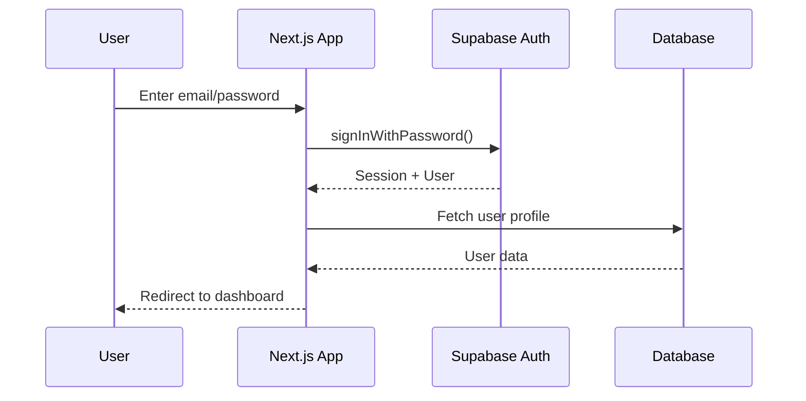

# Authentication Design

## Overview

Using Supabase Auth for authentication with email/password login. Both Doctors and Receptionists have identical permissions (no role-based access control needed).

---

## Auth Flow



---

## Supabase Auth Setup

### 1. Enable Email Provider

In Supabase Dashboard → Authentication → Providers:

- Enable **Email** provider
- Disable "Confirm email" for simplicity (internal app)

### 2. User Metadata

Store role in user metadata during signup:

```typescript
const { data, error } = await supabase.auth.signUp({
  email: "doctor@clinic.com",
  password: "securepassword",
  options: {
    data: {
      name: "Dr. Ahmed",
      role: "DOCTOR", // or 'RECEPTIONIST'
    },
  },
});
```

> **Note**: Staff access both clinics, so no `clinic_id` in user metadata.

---

## Database Integration

### User Table Sync

Create a trigger to sync Supabase Auth users to our `users` table:

```sql
-- Function to handle new user signup
CREATE OR REPLACE FUNCTION public.handle_new_user()
RETURNS trigger AS $$
BEGIN
  INSERT INTO public.users (id, email, name, role, created_at, updated_at)
  VALUES (
    NEW.id,
    NEW.email,
    COALESCE(NEW.raw_user_meta_data->>'name', 'User'),
    COALESCE((NEW.raw_user_meta_data->>'role')::"UserRole", 'RECEPTIONIST'),
    NOW(),
    NOW()
  );
  RETURN NEW;
END;
$$ LANGUAGE plpgsql SECURITY DEFINER;

-- Trigger on auth.users insert
DROP TRIGGER IF EXISTS on_auth_user_created ON auth.users;
CREATE TRIGGER on_auth_user_created
  AFTER INSERT ON auth.users
  FOR EACH ROW EXECUTE FUNCTION public.handle_new_user();
```

---

## Client-Side Implementation

### Supabase Client Setup

```typescript
// lib/supabase/client.ts
import { createBrowserClient } from "@supabase/ssr";

export function createClient() {
  return createBrowserClient(
    process.env.NEXT_PUBLIC_SUPABASE_URL!,
    process.env.NEXT_PUBLIC_SUPABASE_ANON_KEY!,
  );
}
```

### Server-Side Client

```typescript
// lib/supabase/server.ts
import { createServerClient } from "@supabase/ssr";
import { cookies } from "next/headers";

export async function createClient() {
  const cookieStore = await cookies();

  return createServerClient(
    process.env.NEXT_PUBLIC_SUPABASE_URL!,
    process.env.NEXT_PUBLIC_SUPABASE_ANON_KEY!,
    {
      cookies: {
        getAll() {
          return cookieStore.getAll();
        },
        setAll(cookiesToSet) {
          try {
            cookiesToSet.forEach(({ name, value, options }) =>
              cookieStore.set(name, value, options),
            );
          } catch {
            // Handle server component context
          }
        },
      },
    },
  );
}
```

---

## Middleware Protection

```typescript
// middleware.ts
import { createServerClient } from "@supabase/ssr";
import { NextResponse, type NextRequest } from "next/server";

export async function middleware(request: NextRequest) {
  let supabaseResponse = NextResponse.next({ request });

  const supabase = createServerClient(
    process.env.NEXT_PUBLIC_SUPABASE_URL!,
    process.env.NEXT_PUBLIC_SUPABASE_ANON_KEY!,
    {
      cookies: {
        getAll() {
          return request.cookies.getAll();
        },
        setAll(cookiesToSet) {
          cookiesToSet.forEach(({ name, value }) =>
            request.cookies.set(name, value),
          );
          supabaseResponse = NextResponse.next({ request });
          cookiesToSet.forEach(({ name, value, options }) =>
            supabaseResponse.cookies.set(name, value, options),
          );
        },
      },
    },
  );

  const {
    data: { user },
  } = await supabase.auth.getUser();

  // Redirect unauthenticated users to login
  if (!user && !request.nextUrl.pathname.startsWith("/login")) {
    const url = request.nextUrl.clone();
    url.pathname = "/login";
    return NextResponse.redirect(url);
  }

  // Redirect authenticated users away from login
  if (user && request.nextUrl.pathname.startsWith("/login")) {
    const url = request.nextUrl.clone();
    url.pathname = "/";
    return NextResponse.redirect(url);
  }

  return supabaseResponse;
}

export const config = {
  matcher: ["/((?!_next/static|_next/image|favicon.ico|api).*)"],
};
```

---

## Auth Components

### Login Form

```typescript
// components/auth/LoginForm.tsx
'use client'

import { useState } from 'react'
import { createClient } from '@/lib/supabase/client'
import { useRouter } from 'next/navigation'

export function LoginForm() {
  const [email, setEmail] = useState('')
  const [password, setPassword] = useState('')
  const [error, setError] = useState<string | null>(null)
  const [loading, setLoading] = useState(false)
  const router = useRouter()
  const supabase = createClient()

  const handleLogin = async (e: React.FormEvent) => {
    e.preventDefault()
    setLoading(true)
    setError(null)

    const { error } = await supabase.auth.signInWithPassword({
      email,
      password,
    })

    if (error) {
      setError(error.message)
      setLoading(false)
      return
    }

    router.push('/')
    router.refresh()
  }

  return (
    <form onSubmit={handleLogin}>
      {/* Form fields */}
    </form>
  )
}
```

---

## Session Management

### Get Current User Hook

```typescript
// hooks/useUser.ts
"use client";

import { useEffect, useState } from "react";
import { createClient } from "@/lib/supabase/client";
import type { User } from "@supabase/supabase-js";

export function useUser() {
  const [user, setUser] = useState<User | null>(null);
  const [loading, setLoading] = useState(true);
  const supabase = createClient();

  useEffect(() => {
    const getUser = async () => {
      const {
        data: { user },
      } = await supabase.auth.getUser();
      setUser(user);
      setLoading(false);
    };

    getUser();

    const {
      data: { subscription },
    } = supabase.auth.onAuthStateChange((_event, session) => {
      setUser(session?.user ?? null);
    });

    return () => subscription.unsubscribe();
  }, []);

  return { user, loading };
}
```

### Server-Side User Fetch

```typescript
// lib/auth.ts
import { createClient } from "@/lib/supabase/server";
import { prisma } from "@/lib/prisma";

export async function getCurrentUser() {
  const supabase = await createClient();
  const {
    data: { user },
  } = await supabase.auth.getUser();

  if (!user) return null;

  // Fetch full user profile from database
  const dbUser = await prisma.user.findUnique({
    where: { id: user.id },
  });

  return dbUser;
}
```

---

## Environment Variables

```env
# .env.local
NEXT_PUBLIC_SUPABASE_URL=https://your-project.supabase.co
NEXT_PUBLIC_SUPABASE_ANON_KEY=your-anon-key
SUPABASE_SERVICE_ROLE_KEY=your-service-role-key  # For admin operations only
```

---

## Security Notes

1. **No Email Confirmation**: Since this is an internal system, skip email verification
2. **Pre-created Users**: Admin creates user accounts; no public signup
3. **Session Duration**: Default 1 week, configurable in Supabase dashboard
4. **Row Level Security**: Enable RLS on all tables for extra security layer
