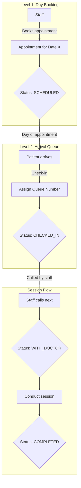

# Appointment System Design

## Overview

A two-level appointment system:

1. **Day Booking**: Staff books patients for a specific date (patient may not exist in DB yet)
2. **Arrival Queue**: Patients get queue numbers on check-in, staff manages order via drag-and-drop

---

## System Flow



---

## Database Schema

```prisma
model Appointment {
  id            String            @id @default(cuid())

  // Patient info - stored directly (patient may not be registered)
  patientName   String            @map("patient_name")
  patientPhone  String            @map("patient_phone")

  // Optional link to existing patient
  patientId     String?           @map("patient_id")
  patient       Patient?          @relation(fields: [patientId], references: [id])

  clinicId      String            @map("clinic_id")
  clinic        Clinic            @relation(fields: [clinicId], references: [id])

  date          DateTime          @db.Date
  status        AppointmentStatus @default(SCHEDULED)
  queueNumber   Int?              @map("queue_number")
  notes         String?

  createdAt     DateTime          @default(now())
  updatedAt     DateTime          @updatedAt

  @@unique([patientPhone, date, clinicId])
  @@index([clinicId, date, status])
}

enum AppointmentStatus {
  SCHEDULED    // Booked, not yet arrived
  CHECKED_IN   // Arrived, in waiting queue
  WITH_DOCTOR  // Currently being seen
  COMPLETED    // Session finished
  NO_SHOW      // Did not arrive
  CANCELLED    // Cancelled by staff
}
```

**Key Changes:**

- `patientName` + `patientPhone` stored directly on appointment (walk-ins supported)
- `patientId` is optional (linked only if patient exists in DB)
- `queueNumber` on Appointment directly (no separate QueueEntry table)
- Removed: `bookedById`, `calledAt`, `completedAt`
- No max queue limit

---

## API Design (Server Actions)

### 1. Book Appointment

```typescript
// actions/appointments.ts
"use server";

export async function bookAppointment(data: {
  patientName: string;
  patientPhone: string;
  patientId?: string; // Optional - if patient exists
  clinicId: string;
  date: string; // ISO date string
  notes?: string;
}) {
  // Validation: Cannot book same phone twice on same day at same clinic
  // Validation: Cannot book in the past

  return await prisma.appointment.create({
    data: {
      patientName: data.patientName,
      patientPhone: data.patientPhone,
      patientId: data.patientId,
      clinicId: data.clinicId,
      date: new Date(data.date),
      notes: data.notes,
      status: "SCHEDULED",
    },
  });
}
```

### 2. Check-In Patient

```typescript
export async function checkInPatient(appointmentId: string) {
  const appointment = await prisma.appointment.findUnique({
    where: { id: appointmentId },
  });

  if (!appointment || appointment.status !== "SCHEDULED") {
    throw new Error("Invalid appointment");
  }

  // Get next queue number for today at this clinic
  const lastInQueue = await prisma.appointment.findFirst({
    where: {
      clinicId: appointment.clinicId,
      date: appointment.date,
      queueNumber: { not: null },
    },
    orderBy: { queueNumber: "desc" },
  });

  const nextQueueNumber = (lastInQueue?.queueNumber ?? 0) + 1;

  return await prisma.appointment.update({
    where: { id: appointmentId },
    data: {
      status: "CHECKED_IN",
      queueNumber: nextQueueNumber,
    },
  });
}
```

### 3. Get Today's Queue

```typescript
export async function getTodayQueue(clinicId: string) {
  const today = new Date();
  today.setHours(0, 0, 0, 0);

  return await prisma.appointment.findMany({
    where: {
      clinicId,
      date: today,
    },
    orderBy: [
      { queueNumber: { sort: "asc", nulls: "last" } },
      { createdAt: "asc" },
    ],
    include: {
      patient: true,
    },
  });
}
```

### 4. Call Next Patient / Update Status

```typescript
export async function updateAppointmentStatus(
  appointmentId: string,
  status: AppointmentStatus,
) {
  return await prisma.appointment.update({
    where: { id: appointmentId },
    data: { status },
  });
}

export async function callNextPatient(clinicId: string) {
  const today = new Date();
  today.setHours(0, 0, 0, 0);

  // Find next waiting patient (lowest queue number with CHECKED_IN status)
  const nextPatient = await prisma.appointment.findFirst({
    where: {
      clinicId,
      date: today,
      status: "CHECKED_IN",
      queueNumber: { not: null },
    },
    orderBy: { queueNumber: "asc" },
  });

  if (!nextPatient) return null;

  return await prisma.appointment.update({
    where: { id: nextPatient.id },
    data: { status: "WITH_DOCTOR" },
  });
}
```

### 5. Reorder Queue (Drag & Drop)

```typescript
export async function reorderQueue(
  appointmentId: string,
  newQueueNumber: number,
  clinicId: string,
) {
  const today = new Date();
  today.setHours(0, 0, 0, 0);

  const appointment = await prisma.appointment.findUnique({
    where: { id: appointmentId },
  });

  if (!appointment?.queueNumber) {
    throw new Error("Appointment not in queue");
  }

  const oldNumber = appointment.queueNumber;

  // Shift other appointments
  if (newQueueNumber < oldNumber) {
    // Moving up: increment those between new and old
    await prisma.appointment.updateMany({
      where: {
        clinicId,
        date: today,
        queueNumber: { gte: newQueueNumber, lt: oldNumber },
      },
      data: { queueNumber: { increment: 1 } },
    });
  } else {
    // Moving down: decrement those between old and new
    await prisma.appointment.updateMany({
      where: {
        clinicId,
        date: today,
        queueNumber: { gt: oldNumber, lte: newQueueNumber },
      },
      data: { queueNumber: { decrement: 1 } },
    });
  }

  // Set the target appointment's new queue number
  return await prisma.appointment.update({
    where: { id: appointmentId },
    data: { queueNumber: newQueueNumber },
  });
}
```

---

## UI Components

### 1. Appointment Booking Dialog

```
┌─────────────────────────────────────────────────────────┐
│  📅 Book Appointment                                    │
├─────────────────────────────────────────────────────────┤
│                                                         │
│  Patient Name:  [____________________________]          │
│                                                         │
│  Phone:         [____________________________]          │
│                                                         │
│  Date:          [📅 February 6, 2026         ]          │
│                                                         │
│  Clinic:        [○ Branch 1]  [● Branch 2]              │
│                                                         │
│  Notes:         [Optional notes...           ]          │
│                                                         │
│            [Cancel]  [Book Appointment ✓]               │
│                                                         │
└─────────────────────────────────────────────────────────┘
```

### 2. Queue Management (Staff View)

```
┌─────────────────────────────────────────────────────────┐
│  📋 Today's Queue - Branch 1          Feb 6, 2026       │
├─────────────────────────────────────────────────────────┤
│  [Scheduled: 5]  [Waiting: 3]  [Completed: 2]           │
├─────────────────────────────────────────────────────────┤
│                                                         │
│  ══════════ WITH DOCTOR ══════════                      │
│  ┌─────────────────────────────────────────────────┐   │
│  │ #2  Omar Hassan        📞 01055566677           │   │
│  │     Status: WITH_DOCTOR                         │   │
│  │             [Complete Session ✓]                │   │
│  └─────────────────────────────────────────────────┘   │
│                                                         │
│  ══════════ WAITING (drag to reorder) ══════════       │
│  ┌─────────────────────────────────────────────────┐   │
│  │ ⠿ #3  Fatima Ibrahim   📞 01011112222           │   │
│  └─────────────────────────────────────────────────┘   │
│  ┌─────────────────────────────────────────────────┐   │
│  │ ⠿ #4  Khaled Mahmoud   📞 01033334444           │   │
│  └─────────────────────────────────────────────────┘   │
│                                                         │
│               [Call Next Patient →]                     │
│                                                         │
│  ══════════ SCHEDULED (not checked in) ══════════      │
│  ┌─────────────────────────────────────────────────┐   │
│  │ Ahmed Mohamed          📞 01012345678           │   │
│  │                        [Check In ✓]             │   │
│  └─────────────────────────────────────────────────┘   │
│                                                         │
└─────────────────────────────────────────────────────────┘
```

---

## Data Refresh (TanStack Query)

No real-time subscriptions. Use TanStack Query with manual invalidation:

```typescript
// hooks/useQueue.ts
import { useQuery, useMutation, useQueryClient } from "@tanstack/react-query";
import {
  getTodayQueue,
  checkInPatient,
  callNextPatient,
} from "@/actions/appointments";

export function useQueue(clinicId: string) {
  return useQuery({
    queryKey: ["queue", clinicId],
    queryFn: () => getTodayQueue(clinicId),
    refetchInterval: 30000, // Auto-refresh every 30s as fallback
  });
}

export function useCheckIn() {
  const queryClient = useQueryClient();

  return useMutation({
    mutationFn: checkInPatient,
    onSuccess: () => {
      queryClient.invalidateQueries({ queryKey: ["queue"] });
    },
  });
}

export function useCallNext() {
  const queryClient = useQueryClient();

  return useMutation({
    mutationFn: callNextPatient,
    onSuccess: () => {
      queryClient.invalidateQueries({ queryKey: ["queue"] });
    },
  });
}
```

---

## Edge Cases

| Scenario                           | Handling                                               |
| ---------------------------------- | ------------------------------------------------------ |
| Walk-in patient (no prior booking) | Create same-day appointment with name + phone          |
| Patient cancels after check-in     | Mark CANCELLED, queue numbers stay (gaps allowed)      |
| Staff needs to reorder queue       | Drag-and-drop interface, updates queue numbers         |
| End of day with no-shows           | Staff manually marks as NO_SHOW (can go past midnight) |
