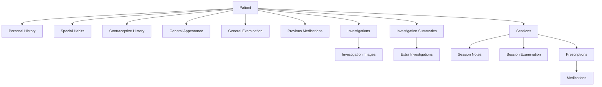
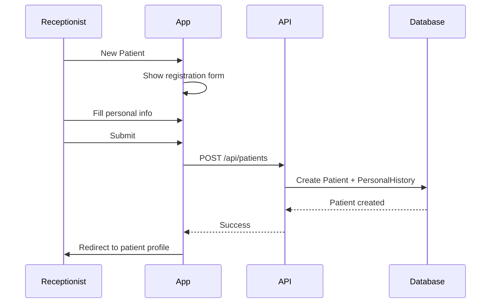

# Patient Management Design

## Overview

Comprehensive patient record management including registration, medical history, examinations, and investigations.

---

## Patient Data Structure



---

## Patient Registration Flow



---

## API Endpoints

### 1. Create Patient

```typescript
POST /api/patients
{
  "clinicId": "clinic-uuid",
  "personalHistory": {
    "fullName": "Ahmed Mohamed",
    "phoneNumber": "01012345678",
    "dateOfBirth": "1990-05-15",
    "sex": "male",
    "maritalStatus": "married",
    "offsprings": 2,
    "occupation": "Engineer",
    "residence": "Cairo"
  }
}
```

### 2. Get Patient

```typescript
GET /api/patients/{id}

Response: {
  "id": "...",
  "personalHistory": {...},
  "specialHabits": {...},
  "contraceptiveHistory": {...},
  "generalAppearance": {...},
  "generalExamination": {...},
  "drugHistory": "...",
  "complaint": "...",
  "presentHistory": "...",
  "pastHistory": "...",
  "familyHistory": "...",
  "provisionalDiagnosis": "...",
  "sessions": [...],
  "investigations": [...]
}
```

### 3. Search Patients

```typescript
GET /api/patients?search=ahmed&clinicId=xxx

// Search by name or phone number
Response: {
  "patients": [
    {
      "id": "...",
      "personalHistory": {
        "fullName": "Ahmed Mohamed",
        "phoneNumber": "01012345678"
      }
    }
  ]
}
```

### 4. Update Patient Sections

```typescript
// Update personal history
PATCH /api/patients/{id}/personal-history
{ "occupation": "Doctor", "residence": "Giza" }

// Update special habits
PATCH /api/patients/{id}/special-habits
{ "smokingType": "cigarettes", "smokingAmount": 10 }

// Update medical info
PATCH /api/patients/{id}/medical
{ "drugHistory": "...", "complaint": "..." }
```

---

## UI Components

### 1. Patient Registration Form

Multi-step form for new patient registration:

```
Step 1: Personal Information
┌─────────────────────────────────────────────────────────┐
│  👤 Register New Patient                                │
├─────────────────────────────────────────────────────────┤
│  Step 1 of 3: Personal Information                      │
│  ━━━━━●━━━━━━━━━━●━━━━━━━━━━○                           │
│                                                         │
│  Full Name *    [                              ]        │
│  Phone *        [                              ]        │
│  Date of Birth *[                              ]        │
│  Sex            [Male ▼]                               │
│  Marital Status [                              ]        │
│  Offsprings     [                              ]        │
│  Occupation     [                              ]        │
│  Residence      [                              ]        │
│                                                         │
│                              [Back]  [Next →]           │
└─────────────────────────────────────────────────────────┘

Step 2: Special Habits (Optional)
Step 3: Review & Submit
```

### 2. Patient Profile View

Tabbed interface for comprehensive patient data:

```
┌─────────────────────────────────────────────────────────┐
│  Ahmed Mohamed                         📞 01012345678   │
│  Male • 35 years • Engineer                             │
├─────┬─────────┬────────────┬──────────┬────────────────┤
│ Info│ History │ Sessions   │ Labs     │ Prescriptions  │
├─────┴─────────┴────────────┴──────────┴────────────────┤
│                                                         │
│  Personal History                              [Edit]   │
│  ───────────────────────────────────────────────────   │
│  Date of Birth:    May 15, 1990                        │
│  Marital Status:   Married                              │
│  Offsprings:       2                                    │
│  Occupation:       Engineer                             │
│  Residence:        Cairo                                │
│                                                         │
│  Special Habits                                [Edit]   │
│  ───────────────────────────────────────────────────   │
│  Smoking:          Cigarettes, 10/day, 5 years         │
│  Alcohol:          No                                   │
│                                                         │
│  Chief Complaint                               [Edit]   │
│  ───────────────────────────────────────────────────   │
│  Chest pain and shortness of breath                    │
│                                                         │
└─────────────────────────────────────────────────────────┘
```

### 3. Patient Search Component

```
┌─────────────────────────────────────────────────────────┐
│  🔍 [Search by name or phone...                    ]    │
├─────────────────────────────────────────────────────────┤
│                                                         │
│  ┌─────────────────────────────────────────────────┐   │
│  │ Ahmed Mohamed              📞 01012345678       │   │
│  │ Male • 35 years • Last visit: Jan 15, 2026     │   │
│  └─────────────────────────────────────────────────┘   │
│                                                         │
│  ┌─────────────────────────────────────────────────┐   │
│  │ Ahmed Ali                  📞 01098765432       │   │
│  │ Male • 42 years • Last visit: Dec 20, 2025     │   │
│  └─────────────────────────────────────────────────┘   │
│                                                         │
└─────────────────────────────────────────────────────────┘
```

---

## Data Validation

### Personal History

```typescript
import { z } from "zod";

export const personalHistorySchema = z.object({
  fullName: z.string().min(2, "Name must be at least 2 characters"),
  phoneNumber: z.string().regex(/^01[0125][0-9]{8}$/, "Invalid Egyptian phone"),
  dateOfBirth: z.date(),
  sex: z.enum(["male", "female"]).optional(),
  maritalStatus: z.string().optional(),
  offsprings: z.number().int().min(0).optional(),
  occupation: z.string().optional(),
  residence: z.string().optional(),
});
```

### Investigation Summary

```typescript
export const investigationSummarySchema = z.object({
  date: z.date(),
  // Hematology
  hb: z.number().positive().optional(),
  wbc: z.number().positive().optional(),
  // ... other fields with appropriate validations
});
```

---

## Patient History Sections

### Medical History Tab

| Section                   | Fields                                 |
| ------------------------- | -------------------------------------- |
| **Drug History**          | Free text for current/past medications |
| **Chief Complaint**       | Primary reason for visit               |
| **Present History**       | Current illness details                |
| **Past History**          | Previous medical conditions            |
| **Family History**        | Family medical conditions              |
| **Provisional Diagnosis** | Doctor's initial assessment            |

### Contraceptive History (For Female Patients)

| Field                 | Type   |
| --------------------- | ------ |
| Menarche age          | Number |
| Menstrual period      | Text   |
| History of abortion   | Text   |
| Mode of contraceptive | Text   |

### General Appearance

| Field        | Options                 |
| ------------ | ----------------------- |
| Built        | Thin, Average, Obese    |
| Behavior     | Calm, Anxious, Agitated |
| Intelligence | Normal, Above, Below    |
| Facies       | Normal, Abnormal        |
| Decubitus    | Comfortable, Distressed |

---

## Search Implementation

```typescript
// lib/patients.ts
export async function searchPatients(query: string, clinicId: string) {
  return prisma.patient.findMany({
    where: {
      clinicId,
      personalHistory: {
        OR: [
          { fullName: { contains: query, mode: "insensitive" } },
          { phoneNumber: { contains: query } },
        ],
      },
    },
    include: {
      personalHistory: true,
    },
    take: 20,
  });
}
```

---

## Data Security

1. **Patient data is clinic-scoped**: Users can only access patients from their clinic
2. **Audit trail**: All updates are timestamped
3. **Soft delete consideration**: For deleted patients, consider soft delete to preserve history
4. **Phone number uniqueness**: Within a clinic, phone numbers should be unique
