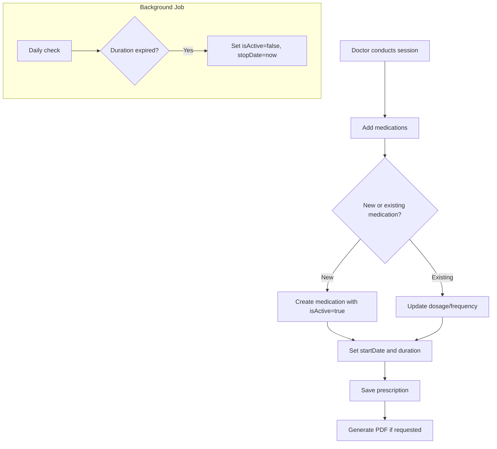

# Prescription Tracking Design

## Overview

Track medications prescribed during sessions, maintain active medication list per patient, and generate printable prescriptions.

---

## Features

| Feature                   | Description                                     |
| ------------------------- | ----------------------------------------------- |
| **Session Prescriptions** | Medications prescribed during each visit        |
| **Active Medications**    | Track what patient is currently taking          |
| **Auto-stop**             | Medications auto-deactivate after duration ends |
| **PDF Generation**        | Printable prescription for patient              |

---

## Data Flow



---

## Database Tables

```prisma
model Prescription {
  id        String   @id @default(cuid())
  sessionId String   @map("session_id")
  createdAt DateTime @default(now())

  session     Session                  @relation(...)
  medications PrescriptionMedication[]
}

model PrescriptionMedication {
  id             String    @id @default(cuid())
  prescriptionId String    @map("prescription_id")
  patientId      String    @map("patient_id") // For cross-session tracking
  type           String?                       // Tablet, Injection, Syrup, etc.
  medication     String
  dosage         String?
  frequency      String?
  duration       String?
  startDate      DateTime? @map("start_date")
  stopDate       DateTime? @map("stop_date")
  isActive       Boolean   @default(true)

  prescription Prescription @relation(...)

  @@index([patientId, isActive])
}
```

---

## API Endpoints

### 1. Create Prescription (During Session)

```typescript
POST /api/sessions/{sessionId}/prescriptions
{
  "medications": [
    {
      "type": "tablet",
      "medication": "Metformin",
      "dosage": "500mg",
      "frequency": "twice daily",
      "duration": "3 months",
      "startDate": "2026-01-30"
    },
    {
      "medication": "Vitamin D",
      "dosage": "10000 IU",
      "frequency": "weekly",
      "duration": "6 months"
    }
  ]
}
```

### 2. Get Patient's Active Medications

```typescript
GET /api/patients/{patientId}/medications/active

Response: {
  "medications": [
    {
      "medication": "Metformin",
      "dosage": "500mg",
      "frequency": "twice daily",
      "startDate": "2026-01-30",
      "remainingDays": 85,
      "prescribedOn": "2026-01-30",
      "doctor": "Dr. Ahmed"
    }
  ]
}
```

### 3. Stop Medication

```typescript
POST /api/medications/{id}/stop
{
  "reason": "Side effects"  // Optional
}
```

### 4. Get Prescription PDF

```typescript
GET /api/prescriptions/{id}/pdf

Response: PDF file stream
```

---

## UI Components

### 1. Prescription Form (In Session)

```
┌─────────────────────────────────────────────────────────┐
│  💊 Prescription                                        │
├─────────────────────────────────────────────────────────┤
│                                                         │
│  ┌─────────────────────────────────────────────────┐   │
│  │ Type:       [Tablet ▼]                          │   │
│  │ Medication: [Metformin                     ]    │   │
│  │ Dosage:     [500mg                         ]    │   │
│  │ Frequency:  [Twice daily ▼]                     │   │
│  │ Duration:   [3 months    ▼]                     │   │
│  │                                    [Remove ✕]   │   │
│  └─────────────────────────────────────────────────┘   │
│                                                         │
│  [+ Add Another Medication]                             │
│                                                         │
│  ─────────────────────────────────────────────────────  │
│                                                         │
│  [Save Draft]           [Save & Print Prescription 🖨️]   │
│                                                         │
└─────────────────────────────────────────────────────────┘
```

### 2. Active Medications View

```
┌─────────────────────────────────────────────────────────┐
│  💊 Active Medications                                  │
├─────────────────────────────────────────────────────────┤
│                                                         │
│  ┌─────────────────────────────────────────────────┐   │
│  │ Metformin 500mg                                 │   │
│  │ Twice daily • Started Jan 15, 2026             │   │
│  │ Remaining: 75 days                              │   │
│  │                                      [Stop ⏹️]   │   │
│  └─────────────────────────────────────────────────┘   │
│                                                         │
│  ┌─────────────────────────────────────────────────┐   │
│  │ Vitamin D 10000 IU                              │   │
│  │ Weekly • Started Jan 15, 2026                   │   │
│  │ Remaining: 165 days                             │   │
│  │                                      [Stop ⏹️]   │   │
│  └─────────────────────────────────────────────────┘   │
│                                                         │
│  ─────────────────────────────────────────────────────  │
│  Past Medications (3)                     [Show ▼]     │
│                                                         │
└─────────────────────────────────────────────────────────┘
```

### 3. Prescription History

```
┌─────────────────────────────────────────────────────────┐
│  📋 Prescription History                                │
├─────────────────────────────────────────────────────────┤
│                                                         │
│  January 30, 2026 - Dr. Ahmed                          │
│  ┌─────────────────────────────────────────────────┐   │
│  │ • Metformin 500mg - Twice daily - 3 months      │   │
│  │ • Vitamin D 10000 IU - Weekly - 6 months        │   │
│  │                                      [Print 🖨️]   │   │
│  └─────────────────────────────────────────────────┘   │
│                                                         │
│  December 15, 2025 - Dr. Ahmed                         │
│  ┌─────────────────────────────────────────────────┐   │
│  │ • Aspirin 75mg - Once daily - Ongoing           │   │
│  │                                      [Print 🖨️]   │   │
│  └─────────────────────────────────────────────────┘   │
│                                                         │
└─────────────────────────────────────────────────────────┘
```

---

## PDF Generation

Using `@react-pdf/renderer` for prescription PDFs:

```typescript
// components/prescriptions/PrescriptionPDF.tsx
import { Document, Page, Text, View, StyleSheet } from '@react-pdf/renderer'

const styles = StyleSheet.create({
  page: { padding: 30, fontFamily: 'Helvetica' },
  header: { flexDirection: 'row', justifyContent: 'space-between' },
  clinicName: { fontSize: 18, fontWeight: 'bold' },
  // ... more styles
})

interface PrescriptionPDFProps {
  clinic: { name: string; address: string; phone: string }
  patient: { name: string; age: number }
  doctor: { name: string }
  medications: Array<{
    medication: string
    dosage: string
    frequency: string
    duration: string
  }>
  date: Date
}

export function PrescriptionPDF({ clinic, patient, doctor, medications, date }: PrescriptionPDFProps) {
  return (
    <Document>
      <Page size="A5" style={styles.page}>
        {/* Header with clinic info */}
        <View style={styles.header}>
          <Text style={styles.clinicName}>{clinic.name}</Text>
          <Text>{format(date, 'dd/MM/yyyy')}</Text>
        </View>

        {/* Patient info */}
        <View>
          <Text>Patient: {patient.name}</Text>
          <Text>Age: {patient.age} years</Text>
        </View>

        {/* Medications */}
        {medications.map((med, i) => (
          <View key={i}>
            <Text>
              {i + 1}. {med.medication} {med.dosage}
            </Text>
            <Text>
              {med.frequency} - {med.duration}
            </Text>
          </View>
        ))}

        {/* Doctor signature */}
        <View>
          <Text>{doctor.name}</Text>
        </View>
      </Page>
    </Document>
  )
}
```

### PDF API Route

```typescript
// app/api/prescriptions/[id]/pdf/route.ts
import { renderToStream } from '@react-pdf/renderer'
import { PrescriptionPDF } from '@/components/prescriptions/PrescriptionPDF'

export async function GET(
  request: Request,
  { params }: { params: { id: string } }
) {
  const prescription = await getPrescriptionWithDetails(params.id)

  const stream = await renderToStream(
    <PrescriptionPDF
      clinic={prescription.session.patient.clinic}
      patient={prescription.session.patient}
      doctor={prescription.session.doctor}
      medications={prescription.medications}
      date={prescription.createdAt}
    />
  )

  return new Response(stream as unknown as ReadableStream, {
    headers: {
      'Content-Type': 'application/pdf',
      'Content-Disposition': `inline; filename="prescription-${params.id}.pdf"`
    }
  })
}
```

---

## Medication Type Options

```typescript
const MEDICATION_TYPES = [
  { value: "tablet", label: "Tablet", labelAr: "أقراص" },
  { value: "capsule", label: "Capsule", labelAr: "كبسولات" },
  { value: "syrup", label: "Syrup", labelAr: "شراب" },
  { value: "injection", label: "Injection", labelAr: "حقن" },
  { value: "cream", label: "Cream", labelAr: "كريم" },
  { value: "drops", label: "Drops", labelAr: "قطرات" },
  { value: "inhaler", label: "Inhaler", labelAr: "بخاخ" },
  { value: "suppository", label: "Suppository", labelAr: "تحاميل" },
];

const FREQUENCY_OPTIONS = [
  { value: "once_daily", label: "Once daily", labelAr: "مرة يومياً" },
  { value: "twice_daily", label: "Twice daily", labelAr: "مرتين يومياً" },
  {
    value: "three_times",
    label: "Three times daily",
    labelAr: "ثلاث مرات يومياً",
  },
  {
    value: "four_times",
    label: "Four times daily",
    labelAr: "أربع مرات يومياً",
  },
  { value: "as_needed", label: "As needed", labelAr: "عند الحاجة" },
  { value: "weekly", label: "Weekly", labelAr: "أسبوعياً" },
];

const DURATION_OPTIONS = [
  { value: "3_days", label: "3 days", labelAr: "3 أيام" },
  { value: "1_week", label: "1 week", labelAr: "أسبوع" },
  { value: "2_weeks", label: "2 weeks", labelAr: "أسبوعين" },
  { value: "1_month", label: "1 month", labelAr: "شهر" },
  { value: "3_months", label: "3 months", labelAr: "3 أشهر" },
  { value: "6_months", label: "6 months", labelAr: "6 أشهر" },
  { value: "ongoing", label: "Ongoing", labelAr: "مستمر" },
];
```

---

## Auto-Deactivation Logic

Daily cron job to deactivate expired medications:

```typescript
// This could be a Supabase Edge Function or external cron
async function deactivateExpiredMedications() {
  const today = new Date();

  await prisma.prescriptionMedication.updateMany({
    where: {
      isActive: true,
      startDate: { not: null },
      duration: { not: null },
      // Custom logic needed for duration parsing
    },
    data: {
      isActive: false,
      stopDate: today,
    },
  });
}
```

> **Note**: For MVP, manual stopping may be simpler. Auto-deactivation can be added later.
